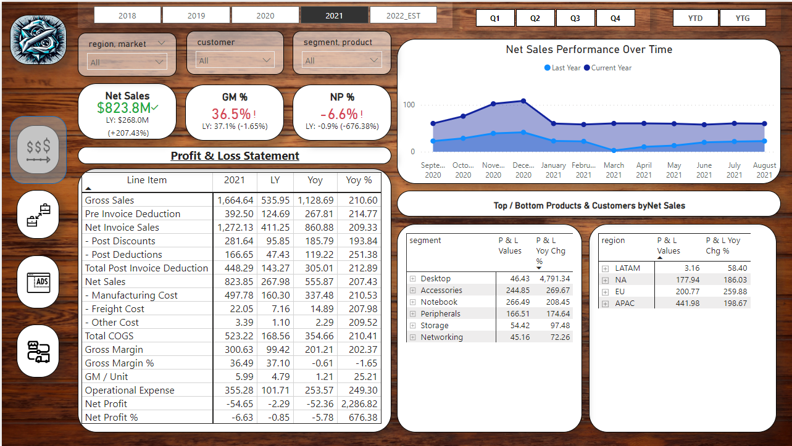
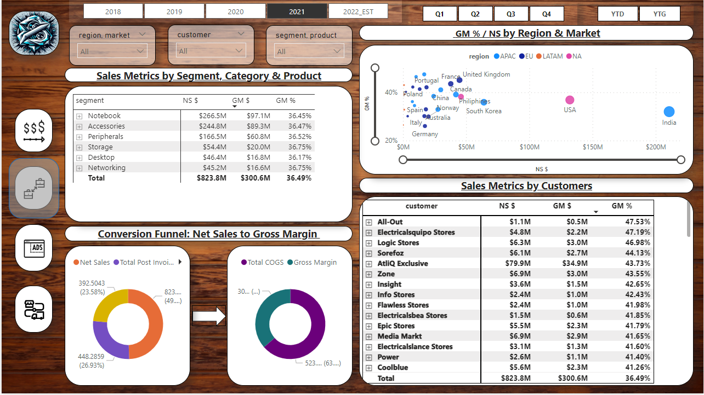
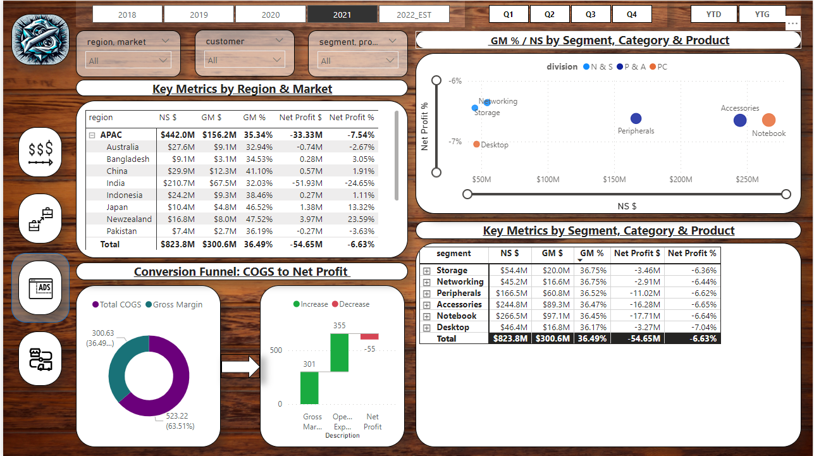
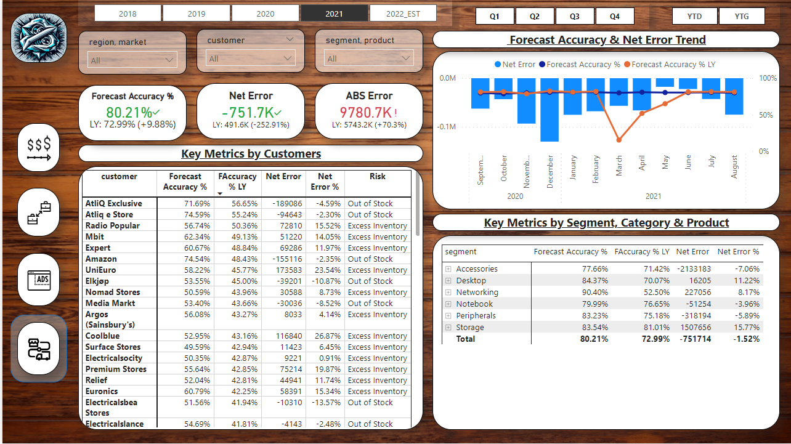

# **Zephyr-Data-Analytics-360-PowerBI**

## **Project Overview:**
At Zephyr Hardware, a global electronics leader, we're transitioning to a data-driven approach with Power BI and SQL to tackle operational challenges. Over-reliance on Excel caused setbacks in certain regions, prompting a data analytics initiative by senior management. Leveraging last year's data, our goal is to enhance performance.

# **For more details on the analysis and full view of the Power BI report, please refer to the attached [PDF report](./Zephyr_hardware_analytics_report.pdf).**

## Data and Modelling
We used a MySQL database to load the data and connected it with Power BI. Data modeling was done in Power BI using the Power Query editor and DAX measures we built as per requirements. Visualizations were then built for the following views:
## **Finance View:**

## **Sales View:**

## **Marketing View:**

## **Supply-Chain View:**

The visualizations provide insights into the performance, trends, and opportunities across these key business functions.

